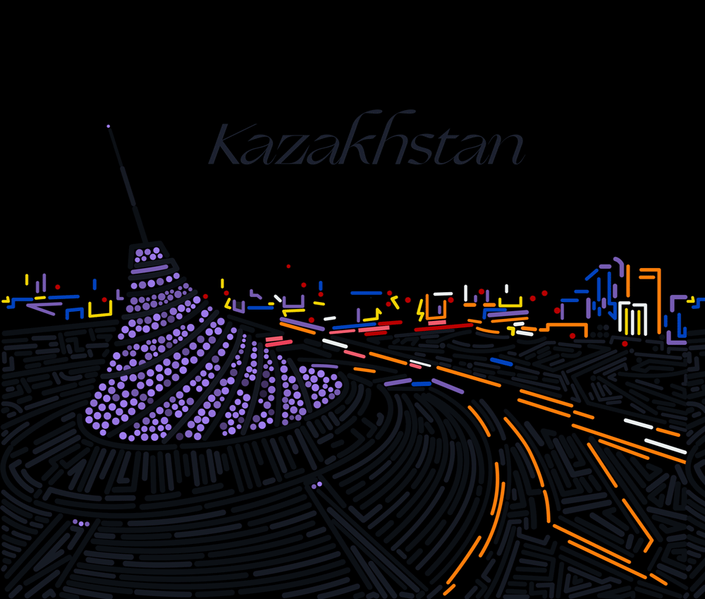

# yfei0054_9103_tut5
## Week 8 Quiz
**Part 1 Imaging Technique Inspiration**

My inspiration comes from Alex Frukta's artwork *Pointillism*, which was featured on Behance. This project uses the pointillism technique to depict night scenes of various cities. Each scene is broken down into dots and lines, where the movement and flickering of the lines simulate effects like traffic flow and city lights. The movement and changing transparency of the dots show how crowds and vehicles move over time. I chose this artwork as inspiration for our major project because we can break down the image into numerous dots and lines, creating dynamic animated scenes through their motion paths.

Alex Frukta, *Pointilism Moscow*, 2021.

Alex Frukta, *Pointilism Kazakhstan*, 2021.

---

**Part 2 Coding Technique Exploration**

I found a coding project by Alfred Chen. The technique can achieve the dot and line compositions mentioned in Part 1. This coding uses object-oriented programming (OOP) to manage each planet's physical properties flexibly, making it easier to extend and control. We can apply this to our major project. For example, by breaking down the water surface in Claude Monet's *Saint Georges majeur au crépuscule* into colour particles and animating their regular movement over time to mimic the natural flow of water. Also, it allows audiences to change the movement of the particles by clicking. The particles can rotate and flow more vigorously, enhancing the visual effect.

Alfred Chen, *Black Hole Genre*, 2022.

